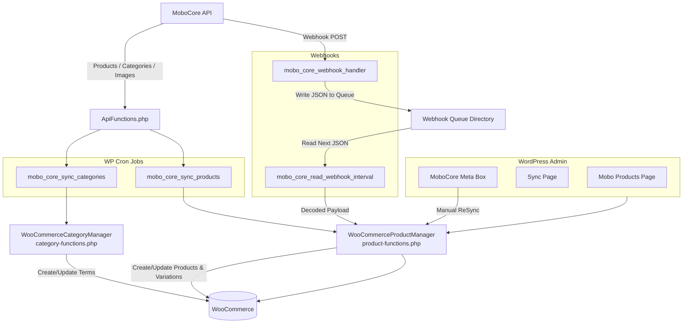
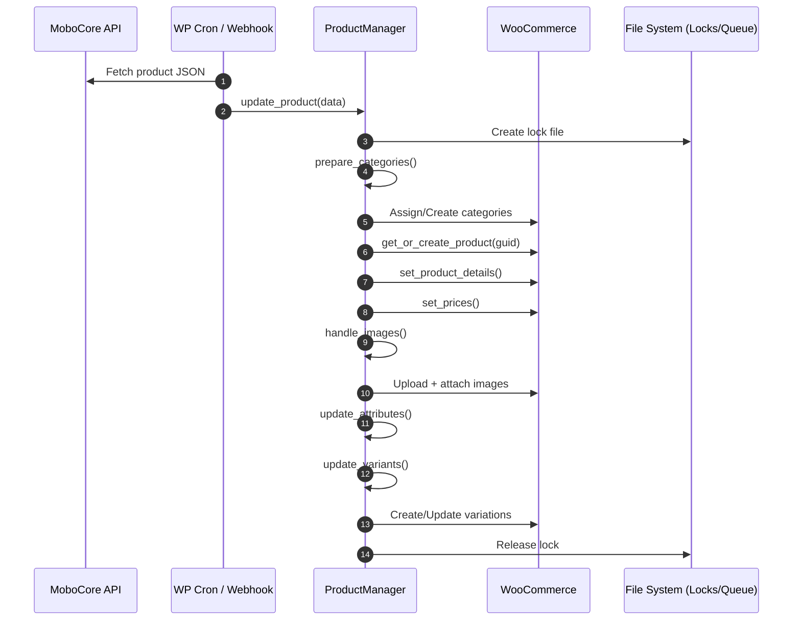

# MoboCore – System Diagrams

Below are all visual architecture and flow diagrams for the WooCommerce integration system.

All diagrams use Mermaid syntax, compatible with GitHub, GitLab, Notion, MkDocs, and many renderers.

---

# 1. System Architecture Overview



# 2. Product Processing Pipeline



# 3. Webhook Queue Workflow

```mermaid
flowchart LR

    A[MoboCore Webhook POST] -->|X-SEC| B[mobo_core_webhook_handler]

    B -->|Validate| C{Valid?}
    C -->|No| Z[Reject Request (403)]
    C -->|Yes| D[Write JSON File]

    D --> F[mobo_core_read_webhook_interval]
    F --> G[Read Next JSON]
    G --> H[Decode JSON]
    H --> I[ProductManager<br/>webhook_update_product()]
    I --> J[process_product_data()]
    J --> K[Update Product & Variants]
    K --> L[Delete Queue File]
```
